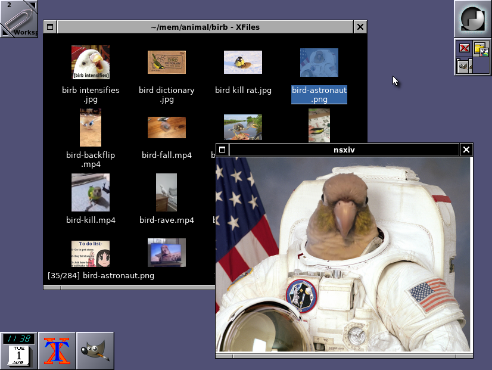

# Paginator



(Paginator is at the top right on the image.)

Paginator is a desktop pager for EWMH-compliant X11 window managers that
support docked applications (dockapps), such as WindowMaker and Fluxbox.

Paginator shows a grid of desktop miniatures representing actual virtual
desktops; each one having window miniatures representing actual windows.
By manipulating those miniatures with the mouse, the user can change the
active window, set the desktop of a window, and switch between desktops.

Paginator is configured solely by X resources and command-line options.

## Options
Paginator understand the following command-line options.

* `-geometry geometry`: Specify the initial size for Paginator.
* `-name name`:         Specify a resource/instance name for Paginator.
* `-xrm resources`:     Specify X resources for Paginator.

## Customization
Paginator can be customized by setting the following X resources.

* `Paginator.activeBackground`:
  Color of the miniature of the active window.
* `Paginator.activeBorderColor`:
  Color of the border of the miniature of the active window.
* `Paginator.activeTopShadowColor`:
  Color of the light shadow of the miniature of the active window.
* `Paginator.activeBottomShadowColor`:
  Color of the heavy shadow of the miniature of the active window.
* `Paginator.borderWidth`:
  Width in pixels of the border around the miniatures of windows.
* `Paginator.currentDesktopBackground`:
  Color of the current desktop miniature.
* `Paginator.desktopBackground`:
  Color of a desktop miniature.
* `Paginator.frameTopShadowColor`:
  Color of the light shadow around Paginator.
* `Paginator.frameBottomShadowColor`:
  Color of the heavy shadow around Paginator.
* `Paginator.frameShadowThickness`:
  Width in pixels of the 3D shadow frame around Paginator.
* `Paginator.geometry`:
  Initial geometry of paginator.
* `Paginator.inactiveBackground`:
  Color of the miniature of a regular window.
* `Paginator.inactiveBorderColor`:
  Color of the border of the miniature of a regular window.
* `Paginator.inactiveTopShadowColor`:
  Color of the light shadow of the miniature of a regular window.
* `Paginator.inactiveBottomShadowColor`:
  Color of the heavy shadow of the miniature of a regular window.
* `Paginator.urgentBackground`:
  Color of the miniature of an urgent window.
* `Paginator.urgentBorderColor`:
  Color of the border of the miniature of an urgent window.
* `Paginator.urgentTopShadowColor`:
  Color of the light shadow of the miniature of an urgent window.
* `Paginator.urgentBottomShadowColor`:
  Color of the heavy shadow of the miniature of an urgent window.
* `Paginator.separatorColor`:
  Color of the separator between desktop miniatures.
* `Paginator.separatorWidth`:
  Width in pixels of the separator between desktop miniatures.
* `Paginator.shadowThickness`:
  Width in pixels of the 3D shadows.

## Installation
Run `make all` to build, and `make install` to install the binary and
the manual into `${PREFIX}` (`/usr/local`).

## Usage
Run `paginator` with a number of rows and columns:

```
$ paginator 2 3
```

This creates the following pager:

```
+-------+-------+-------+
|       |       |       |
|   1   |   2   |   3   |
|       |       |       |
+-------+-------+-------+
|       |       |       |
|   4   |   5   |   6   |
|       |       |       |
+-------+-------+-------+
```

## License
The code and manual are under the MIT/X license.
See `./LICENSE` for more information.

## Epilogue
**Read the manual.**
